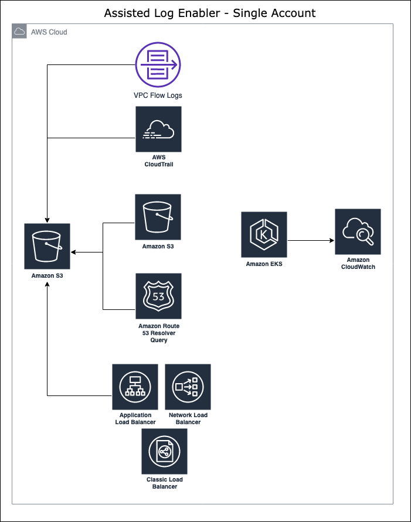
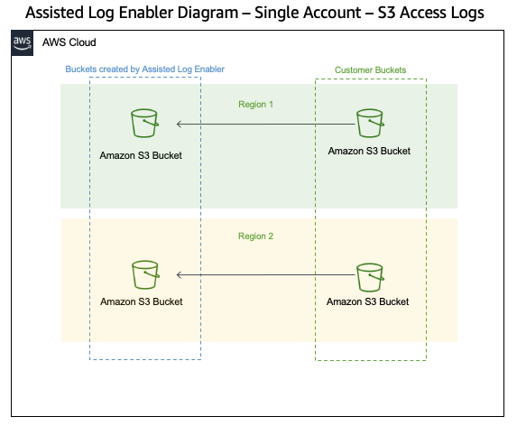
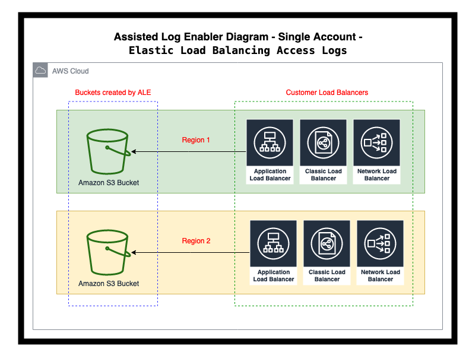

# Assisted Log Enabler for AWS - Find resources that are not logging, and turn them on.
Assisted Log Enabler for AWS is for customers who do not have logging turned on for various services, and lack knowledge of best practices and/or how to turn them on.

With Assisted Log Enabler for AWS, logging is turned on automatically for the various AWS Services for a customer:
* Amazon VPC Flow Logs (Single Account and Multi-Account using AWS Organizations)
* AWS CloudTrail (Single Account Only)
* Amazon Elastic Kubernetes Service (EKS) Audit and Authenticator Logs (Single Account and Multi-Account using AWS Organizations)
* Amazon Route 53 Resolver Query Logs (Single Account and Multi-Account using AWS Organizations)
* Amazon S3 Server Access Logs (Single Account and Multi-Account using AWS Organizations)
* NEW! Elastic Load Balancing Access Logs (Single Account and Multi-Account using AWS Organizations)

Link to related AWS Open Source Blog Post: [Introducing Assisted Log Enabler for AWS](https://aws.amazon.com/blogs/opensource/introducing-assisted-log-enabler-for-aws/)

## Use Case
Logging information is important for troubleshooting issues and analyzing performance, and when Amazon Web Services (AWS) customers do not have logging turned on, the ability to assist them becomes limited, to the point that performing analysis may be impossible. In some cases, customers may not have the technical expertise needed to set up logging properly for the various AWS services.

Assisted Log Enabler for AWS is designed to ease the customer burden of learning how to turn on logs in the middle of a security incident. Assisted Log Enabler for AWS performs the work of creating an Amazon Simple Storage Service (S3) bucket, checking the services to see if logging is turned on, and activating logging when it's found to be off.

When this work is performed, the customer can be assured that logging within their AWS environment is active to facilitate the investigation of future (and possibly ongoing) security incidents.

## Diagram
The following is a simple diagram on how Assisted Log Enabler for AWS works in a single account, in order to turn on logging for customers.



The following is a simple diagram on how Assisted Log Enabler for AWS works with turning on Amazon S3 Server Access Logging in a single account:



The following is a simple diagram on how Assisted Log Enabler for AWS works with turning on Elastic Load Balancing Access Logging in a single account:



## Prerequisites
### Permissions
The following permissions are needed within AWS IAM for Assisted Log Enabler for AWS to run. Please see each section for a breakdown per AWS Service and functionality:
```
# All permissions used within Assisted Log Enabler for AWS:
"ec2:DescribeVpcs",
"ec2:DescribeFlowLogs",
"ec2:CreateFlowLogs",
"ec2:CreateTags",
"logs:CreateLogDelivery",
"s3:GetBucketPolicy",
"s3:PutBucketPolicy",
"s3:PutLifecycleConfiguration"
"s3:PutObject",
"s3:CreateBucket",
"cloudtrail:StartLogging",
"cloudtrail:CreateTrail",
"cloudtrail:DescribeTrails",
"eks:UpdateClusterConfig",
"eks:ListClusters",
"route53resolver:ListResolverQueryLogConfigAssociations",
"route53resolver:CreateResolverQueryLogConfig",
"route53resolver:AssociateResolverQueryLogConfig",
"route53resolver:TagResource",
"iam:CreateServiceLinkRole", # This is used to create the AWSServiceRoleForRoute53 Resolver, which is used for creating the Amazon Route 53 Query Logging Configurations.
"route53resolver:ListResolverQueryLogConfigs",
"route53resolver:ListTagsForResource",
"route53resolver:DisassociateResolverQueryLogConfig",
"route53resolver:DeleteResolverQueryLogConfig"
"s3:PutBucketLogging",
"s3:GetBucketLogging",
"s3:ListBucket",
"s3:ListAllMyBuckets",
"s3:GetBucketLocation",
"s3:GetBucketAcl",
"s3:PutBucketAcl",
"s3:PutBucketPublicAccessBlock",
"s3:PutBucketLifecycleConfiguration"

# For adding AWS CloudTrail logs:
"s3:GetBucketPolicy",
"s3:PutBucketPolicy",
"s3:PutLifecycleConfiguration"
"s3:PutObject",
"s3:CreateBucket",
"cloudtrail:StartLogging",
"cloudtrail:CreateTrail",
"cloudtrail:DescribeTrails"

# For adding Amazon VPC Flow Logs:
"s3:GetBucketPolicy",
"s3:PutBucketPolicy",
"s3:PutLifecycleConfiguration"
"s3:PutObject",
"s3:CreateBucket",
"ec2:DescribeVpcs",
"ec2:DescribeFlowLogs",
"ec2:CreateFlowLogs",
"ec2:CreateTags"

# For adding Amazon EKS logs:
"eks:UpdateClusterConfig",
"eks:ListClusters",
"logs:CreateLogDelivery"

# For adding Amazon Route 53 Resolver Query Logs:
"s3:GetBucketPolicy",
"s3:PutBucketPolicy",
"s3:PutLifecycleConfiguration"
"s3:PutObject",
"s3:CreateBucket",
"ec2:DescribeVpcs",
"route53resolver:ListResolverQueryLogConfigAssociations",
"route53resolver:CreateResolverQueryLogConfig",
"route53resolver:AssociateResolverQueryLogConfig",
"route53resolver:TagResource",
"iam:CreateServiceLinkRole" # This is used to create the AWSServiceRoleForRoute53 Resolver, which is used for creating the Amazon Route 53 Query Logging Configurations.

# For adding Amazon S3 Server Access Logs:
"s3:PutBucketLogging",
"s3:GetBucketLogging",
"s3:ListBucket",
"s3:ListAllMyBuckets",
"s3:GetBucketLocation",
"s3:GetBucketAcl",
"s3:PutBucketAcl",
"s3:PutBucketPublicAccessBlock",
"s3:PutBucketLifecycleConfiguration"

# NEW! For adding Elastic Load Balancing Access Logs:
"elb:DescribeLoadBalancers",
"elb:DescribeLoadBalancerAttributes",
"elb:ModifyLoadBalancerAttributes",
"elbv2:DescribeLoadBalancers",
"elbv2:DescribeLoadBalancerAttributes",
"elbv2:ModifyLoadBalancerAttributes",
"elasticloadbalancing:DescribeLoadBalancers",
"elasticloadbalancing:DescribeLoadBalancerAttributes",
"elasticloadbalancing:ModifyLoadBalancerAttributes"

# For cleanup of Amazon Route 53 Resolver Query Logs created by Assisted Log Enabler for AWS:
"route53resolver:ListResolverQueryLogConfigs",
"route53resolver:ListTagsForResource",
"route53resolver:ListResolverQueryLogConfigAssociations",
"route53resolver:DisassociateResolverQueryLogConfig",
"route53resolver:DeleteResolverQueryLogConfig"
```
Additionally, if running from within a AWS Lambda function, the function will need the AWSLambdaBasicExecutionRole in order to run successfully. Please refer to the following link for more details: https://docs.aws.amazon.com/lambda/latest/dg/lambda-intro-execution-role.html


## Workflow Details
The following are the details of what happens within the Assisted Log Enabler for AWS workflow:
* An Amazon S3 bucket is created within the customer's account.
* A Lifecycle Policy is created for the bucket, with the following parameters:
   * Converts files to Intelligent-Tiering storage after 90 days
   * Deletes files after 365 days
* Block Public Access is explicitly set to On for the S3 bucket created.
* Amazon VPCs are checked to see if flow logs are turned on or off.
* For Amazon VPCs that do not have flow logs turned on, VPC Flow Logging is turned on, and sent to the bucket created.
   * Amazon VPC Flow Logs version 2, 3, 4, and 5 fields are all enabled.
* AWS CloudTrail service is checked to see there is at least one CloudTrail configured. (Single Account only as of this release)
* If no trail is configured, one is created and configured to log to the bucket created. (Single Account only as of this release)
* If Amazon EKS Clusters exist, audit & authenticator logs are turned on.
* Amazon Route 53 Query Logging is turned on for VPCs that do not have it turned on already.
* Amazon S3 Server Access Logs are created for buckets that do not have it turned on already.
   * This does not include for S3 buckets created by Assisted Log Enabler for AWS
   * Amazon S3 Server Access Logs require buckets that reside in the same account & region, so additional buckets for Amazon S3 Server Access logs are created for this.
 * NEW! Elastic Load Balancing Access Logs are created for Application, Network and Classic Load Balancers that do not have it turned on already.
   * Elastic Load Balancing Access Logs require buckets that reside in the region, so additional buckets for Elastic Load Balancing Access logs are created for this.
   * The following table contains the account IDs to use in place of elb-account-id in the bucket policy: https://docs.aws.amazon.com/elasticloadbalancing/latest/application/load-balancer-access-logs.html

## Running the Code
The code in its current form can be ran inside the following:
* AWS CloudShell (preferred)
* AWS Lambda

```
python3 assisted_log_enabler.py

 █████  ███████ ███████ ██ ███████ ████████ ███████ ██████ 
██   ██ ██      ██      ██ ██         ██    ██      ██   ██ 
███████ ███████ ███████ ██ ███████    ██    █████   ██   ██ 
██   ██      ██      ██ ██      ██    ██    ██      ██   ██ 
██   ██ ███████ ███████ ██ ███████    ██    ███████ ██████  
                                                           

                ██       ██████   ██████                   
                ██      ██    ██ ██                        
                ██      ██    ██ ██   ███                  
                ██      ██    ██ ██    ██                  
                ███████  ██████   ██████                    
                                                            

███████ ███    ██  █████  ██████  ██      ███████ ██████    
██      ████   ██ ██   ██ ██   ██ ██      ██      ██   ██   
█████   ██ ██  ██ ███████ ██████  ██      █████   ██████    
██      ██  ██ ██ ██   ██ ██   ██ ██      ██      ██   ██   
███████ ██   ████ ██   ██ ██████  ███████ ███████ ██   ██ 
         Joshua "DozerCat" McKiddy - Customer Incident Response Team (CIRT) - AWS
         Twitter: @jdubm31
         Type -h for help.

No valid option selected. Please run with -h to display valid options.
```
* Options
```
python3 assisted_log_enabler.py -h
usage: assisted_log_enabler.py [-h] [--mode MODE] [--bucket BUCKET]
                               [--include_accounts ACCOUNT_NUMBERS]
                               [--exclude_accounts ACCOUNT_NUMBERS] [--all]
                               [--eks] [--vpcflow] [--r53querylogs] [--s3logs]
                               [--lblogs] [--cloudtrail]
                               [--single_r53querylogs] [--single_cloudtrail]
                               [--single_vpcflow] [--single_all]
                               [--single_s3logs] [--single_lblogs]
                               [--single_account] [--multi_account]

Assisted Log Enabler - Find resources that are not logging, and turn them on.

optional arguments:
  -h, --help            show this help message and exit
  --mode MODE           Choose the mode that you want to run Assisted Log
                        Enabler in. Available modes: single_account,
                        multi_account, cleanup, dryrun. WARNING: For
                        multi_account, You must have the associated
                        CloudFormation template deployed as a StackSet. See
                        the README file for more details.
  --bucket BUCKET       Specify the name of a pre-existing S3 bucket that you
                        want Assisted Log Enabler to store logs in. Otherwise,
                        a new S3 bucket will be created (default). Only used
                        for Amazon VPC Flow Logs, Amazon Route 53 Resolver
                        Query Logs, and AWS CloudTrail logs. WARNING: For
                        multi_account, this will replace the bucket policy.
                        For single_account, this may add statements to the
                        bucket policy.
  --include_accounts ACCOUNT_NUMBERS
                        Specify a comma separated list of AWS account numbers
                        to INCLUDE for multi_account mode.
  --exclude_accounts ACCOUNT_NUMBERS
                        Specify a comma separated list of AWS account numbers
                        to EXCLUDE for multi_account mode.

Single & Multi Account Options:
  Use these flags to choose which services you want to turn logging on for.

  --all                 Turns on all of the log types within the Assisted Log
                        Enabler for AWS.
  --eks                 Turns on Amazon EKS audit & authenticator logs.
  --vpcflow             Turns on Amazon VPC Flow Logs.
  --r53querylogs        Turns on Amazon Route 53 Resolver Query Logs.
  --s3logs              Turns on Amazon Bucket Logs.
  --lblogs              Turns on Amazon Load Balancer Logs.
  --cloudtrail          Turns on AWS CloudTrail. Only available in Single
                        Account version.

Cleanup Options:
  Use these flags to choose which resources you want to turn logging off
  for.

  --single_r53querylogs
                        Removes Amazon Route 53 Resolver Query Log resources
                        created by Assisted Log Enabler for AWS.
  --single_cloudtrail   Removes AWS CloudTrail trails created by Assisted Log
                        Enabler for AWS.
  --single_vpcflow      Removes Amazon VPC Flow Log resources created by
                        Assisted Log Enabler for AWS.
  --single_all          Turns off all of the log types within the Assisted Log
                        Enabler for AWS.
  --single_s3logs       Removes Amazon Bucket Log resources created by
                        Assisted Log Enabler for AWS.
  --single_lblogs       Removes Amazon Load Balancer Log resources created by
                        Assisted Log Enabler for AWS.

Dry Run Options:
  Use these flags to run Assisted Log Enabler for AWS in Dry Run mode.

  --single_account      Runs Assisted Log Enabler for AWS in Dry Run mode for
                        a single AWS account.
  --multi_account       Runs Assisted Log Enabler for AWS in Dry Run mode for
                        a multi-account AWS environment, using AWS
                        Organizations.
```

### Step-by-Step Instructions (for running in AWS CloudShell, single account mode)
1. Log into the AWS Console of the account you want to run the Assisted Log Enabler for AWS.
   * Ensure that the principal being used to log into the AWS Console has the permissions [above](https://github.com/awslabs/assisted-log-enabler-for-aws#permissions).
2. Click on the icon for AWS Cloudshell next to the search bar.
   * Ensure that you're in a region where AWS CloudShell is currently available.
3. Once the session begins, download the Assisted Log Enabler for AWS within the AWS CloudShell session.
```
git clone https://github.com/awslabs/assisted-log-enabler-for-aws.git
```
4. Change the directory to the folder cloned from the link in Step 3:
```
cd assisted-log-enabler-for-aws
```
5. Run the following command to run the Assisted Log Enabler in single account mode, for the AWS service or services you want to check for:
```
# For all services:
python3 assisted_log_enabler.py --mode single_account --all
# For Amazon EKS:
python3 assisted_log_enabler.py --mode single_account --eks
# For Amazon VPC Flow Logs:
python3 assisted_log_enabler.py --mode single_account --vpcflow
# For Amazon Route 53 Resolver Query Logs:
python3 assisted_log_enabler.py --mode single_account --r53querylogs
# For AWS CloudTrail:
python3 assisted_log_enabler.py --mode single_account --cloudtrail
# For Amazon S3 Server Access Logs:
python3 assisted_log_enabler.py --mode single_account --s3logs
# NEW! For Elastic Load Balancing Access Logs:
python3 assisted_log_enabler.py --mode single_account --lblogs
```

### Step-by-Step Instructions (for running in AWS CloudShell, multi account mode)
1. Log into the AWS Console of the account you want to run the Assisted Log Enabler for AWS.
   * Ensure that the AWS Account you're in is the account you want to store the logs. Additionally, ensure that the AWS account you're in has access to the AWS Organizations information within your AWS environment.
   * You may have to register your AWS account as a delegated administrator within AWS CloudFormation, in order to run this code in an AWS account of your choosing. Please see the following link for more details: [Register a delegated administrator](https://docs.aws.amazon.com/AWSCloudFormation/latest/UserGuide/stacksets-orgs-delegated-admin.html)
2. Within the AWS Console, go to AWS CloudFormation.
3. To deploy the IAM Permissions within all child accounts: Within AWS CloudFormation, go to StackSets.
4. Within the StackSets screen, select Create StackSet.
5. In Step 1, under Specify Template, select Upload a template file, and use the AWS CloudFormation template provided in the permissions folder. [Link to the file](https://github.com/awslabs/assisted-log-enabler-for-aws/blob/main/permissions/ALE_child_account_role.yaml)
6. In Step 2, under StackSet Name, add a descriptive name.
7. In Step 2, under Parameters, add the parameters required:
   * AssistedLogEnablerPolicyName: You can leave this default, but you can also change it if desired.
   * OrgId: Provide the AWS Organization ID
   * SourceAccountNumber: Provide the source AWS account number that the Assisted Log Enabler for AWS will be running.
8. In Step 3, add any tags that you desire, as well as any permissions options that you want to select.
   * The service-managed permissions work just fine for Assisted Log Enabler for AWS, but you can use self-service permissions if desired.
9. In Step 4, under Deployment targets, select the option that fits for your AWS Organization.
   * If you Deploy to Organization, it will deploy to all AWS accounts except the root AWS account. If you want to include that one, you can either deploy the template to the root AWS account directly, or use the other option (details below).
   * If you Deploy to organizational units (OUs), you can deploy directly to OUs that you define, including the root OU.
10. In Step 4, under Specify Regions, select US East (N.Virginia).
   * There's no need to select multiple regions here. This template only deploys AWS IAM resources, which are Global.
11. In Step 4, under Deployment options, leave the default settings.
12. In Step 5, review the settings you've set in the previous steps. If all is correct, check the box that states "I acknowledge that AWS CloudFormation might create IAM resources with custom names."
   * Once this is submitted, you'll need to wait until the StackSet is fully deployed. If there are errors, please examine the error and ensure that all the information from the above steps are correct.
13. To deploy the IAM Permissions within the AWS Account where Assisted Log Enabler for AWS is being ran: Within AWS CloudFormation, go to Stacks.
14. Within the Stacks screen, go to the Create Stack dropdown, and select With new resources.
15. In Step 1, select Upload a template file, select Choose File, and use the AWS CloudFormation template provided in the permissions folder. [Link to the file](https://github.com/awslabs/assisted-log-enabler-for-aws/blob/main/permissions/ALE_child_account_role.yaml)
16. In Step 2, under Stack Name, add a descriptive name.
17. In Step 2, under Parameters, add the parameters required:
   * AssistedLogEnablerPolicyName: You can leave this default, but you can also change it if desired.
   * OrgId: Provide the AWS Organization ID
   * SourceAccountNumber: Provide the source AWS account number that the Assisted Log Enabler for AWS will be running.
18. In Step 3, add any tags that you desire, as well as any permissions options that you want to select.
   * The service-managed permissions work just fine for Assisted Log Enabler for AWS, but you can use self-service permissions if desired.
19. In Step 5, review the settings you've set in the previous steps. If all is correct, check the box that states "I acknowledge that AWS CloudFormation might create IAM resources with custom names."
   * Once this is submitted, you'll need to wait until the StackSet is fully deployed. If there are errors, please examine the error and ensure that all the information from the above steps are correct.
20. Once both the StackSet and Stack are successfully deployed, click on the icon for AWS Cloudshell next to the search bar.
   * Ensure that you're in a region where AWS CloudShell is currently available.
21. Once the session begins, download the Assisted Log Enabler for AWS within the AWS CloudShell session.
```
git clone https://github.com/awslabs/assisted-log-enabler-for-aws.git
```
22. Change the directory to the folder cloned from the link in Step 21:
```
cd assisted-log-enabler-for-aws
```
23. Run the following command to run the Assisted Log Enabler in multi account mode, for the AWS service or services you want to check for:
```
# For all services:
python3 assisted_log_enabler.py --mode multi_account --all
# For Amazon EKS:
python3 assisted_log_enabler.py --mode multi_account --eks
# For Amazon VPC Flow Logs:
python3 assisted_log_enabler.py --mode multi_account --vpcflow
# For Amazon Route 53 Resolver Query Logs:
python3 assisted_log_enabler.py --mode multi_account --r53querylogs
For Amazon S3 Server Access Logs:
python3 assisted_log_enabler.py --mode multi_account --s3logs
# NEW! For Elastic Load Balancing Access Logs:
python3 assisted_log_enabler.py --mode multi_account --lblogs

```


### Logging
A log file containing the detailed output of actions will be placed in the root directory of the Assisted Log Enabler for AWS tool. The format of the file will be ALE_timestamp_here.log

Sample output within the log file:
```
2021-02-23 05:31:54,207 - INFO - Creating a list of VPCs without Flow Logs on in region us-west-2.
2021-02-23 05:31:54,208 - INFO - DescribeVpcs API Call
2021-02-23 05:31:54,679 - INFO - List of VPCs found within account 111122223333, region us-west-2:
2021-02-23 05:31:54,679 - INFO - DescribeFlowLogs API Call
2021-02-23 05:31:54,849 - INFO - List of VPCs found within account 111122223333, region us-west-2 WITHOUT VPC Flow Logs:
2021-02-23 05:31:54,849 - INFO - Activating logs for VPCs that do not have them turned on.
2021-02-23 05:31:54,849 - INFO - If all VPCs have Flow Logs turned on, you will get an MissingParameter error. That is normal.
2021-02-23 05:31:54,849 - INFO - CreateFlowLogs API Call
2021-02-23 05:31:54,944 - ERROR - An error occurred (MissingParameter) when calling the CreateFlowLogs operation: The request must include the ResourceIds parameter. Add the required parameter and retry the request.
2021-02-23 05:31:54,946 - INFO - Checking to see if CloudTrail is on, and will activate if needed.
2021-02-23 05:31:54,946 - INFO - DescribeTrails API Call
2021-02-23 05:31:54,983 - INFO - There is a CloudTrail trail active. No action needed.
2021-02-23 05:31:54,984 - INFO - Turning on audit and authenticator logging for EKS clusters in region af-south-1.
```

## Dry Run Mode
Dry Run modes for single and multi-account are both available. These modes allow you to check for resources in your environment that do not have logging turned on, but does not activate the logging for said resources.

To run Assisted Log Enabler for AWS in Dry Run mode, you can use the commands below:
```
# Single Account Dry Run
python3 assisted_log_enabler.py --mode dryrun --single_account
# Multi-Account Dry Run
python3 assisted_log_enabler.py --mode dryrun --multi_account
```

## Cleaning Up
Once the logs have been enabled, you can safely remove any of the downloaded files from AWS CloudShell.
* Note: The log file containing the detailed output of actions will be in the root directory of the Assisted Log Enabler for AWS tool. If you want to retain this, please download this to a safe place, either locally or to an Amazon S3 bucket, for your records. For information on how to download files from AWS CloudShell sessions, refer to the following [link](https://docs.aws.amazon.com/cloudshell/latest/userguide/working-with-cloudshell.html#files-storage).

For any AWS IAM Roles that are created, either manually or using AWS CloudFormation StackSets, those can be safely deleted upon enablement of logs through the Assisted Log Enabler for AWS.

A cleanup mode is available within the Assisted Log Enabler for AWS (currently only for single account). Collected logs within Amazon S3 will NOT be removed, however, logging resources can be removed by following the below commands:
```
# To remove Amazon Route 53 Resolver Query Log resources created by Assisted Log Enabler for AWS (single account):
python3 assisted_log_enabler.py --mode cleanup --single_r53querylogs
# To remove Amazon VPC Flow Log resources created by Assisted Log Enabler for AWS (single account):
python3 assisted_log_enabler.py --mode cleanup --single_vpcflow
# To remove AWS CloudTrail trails created by Assisted Log Enabler for AWS (single account):
python3 assisted_log_enabler.py --mode cleanup --single_cloudtrail
# To remove Amazon S3 Server Access logging created by Assisted Log Enabler for AWS (single account):
python3 assisted_log_enabler.py --mode cleanup --single_s3logs
# NEW! To remove Elastic Load Balancing Access logging created by Assisted Log Enabler for AWS (single account):
python3 assisted_log_enabler.py --mode cleanup --single_lblogs
```

## Shared Responsibility Model
All resources created fall into the customer side of the Shared Responsibility Model.

For AWS customers, please refer to the following link for more information about the Shared Responsibility Model: [Link](https://aws.amazon.com/compliance/shared-responsibility-model/)

## Additional Tools
For analyzing logs created by Assisted Log Enabler for AWS, consider taking a look at the AWS Security Analytics Bootstrap, a tool that provides an Amazon Athena analysis environment that's quick to deploy, ready to use, and easy to maintain. [Link to GitHub repository.](https://github.com/awslabs/aws-security-analytics-bootstrap)

For an point-and-quick solution to analyze Amazon VPC Flow Logs, check out [this AWS blog post](https://aws.amazon.com/blogs/networking-and-content-delivery/analyze-vpc-flow-logs-with-point-and-click-amazon-athena-integration/) for instructions on how to deploy an Amazon Athena analysis environment that's compatible with your Amazon VPC Flow Logs, and provides several sample queries that can allow you to perform an investigation quickly without worrying about the format of the Amazon VPC Flow Logs.


## Costs
For answers to cost-related questions involved with this solution, refer to the following links:
* AWS CloudTrail Pricing: [Link](https://aws.amazon.com/cloudtrail/pricing/)
* Amazon S3 Pricing: [Link](https://aws.amazon.com/s3/pricing/)
* Amazon VPC Flow Logs Pricing: [Link](https://docs.aws.amazon.com/vpc/latest/userguide/flow-logs.html#flow-logs-pricing)
* Amazon Route 53 Pricing (look for the Route 53 Resolver Query Logs section): [Link](https://aws.amazon.com/route53/pricing/)
* Amazon EKS Control Plane Logging: [Link](https://docs.aws.amazon.com/eks/latest/userguide/control-plane-logs.html)
* Elastic Load Balancing Logging: [Link](https://aws.amazon.com/elasticloadbalancing/pricing/)


## Feedback
Please use the [Issues](https://github.com/awslabs/assisted-log-enabler-for-aws/issues) section to submit any feedback, such as features or recommendations, as well as any bugs that are encountered.


## Security

See [CONTRIBUTING](CONTRIBUTING.md#security-issue-notifications) for more information.


## License

This project is licensed under the Apache-2.0 License.
